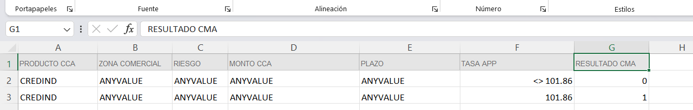
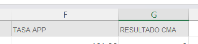

# LECTOR DE DOCUMENTOS EXCEL
Servicio que permite leer documentos excel, para poder generar archivos JSON que permiten armar querys para registrarlo en mongo.

## PRIMERA CONSIDERACIÓN
En la primera fila solo debe existir los campos de las cabeceras del excel.



## SEGUNDA CONSIDERACIÓN
Los nombres de la cabecera no deben contener guín abajo ( ```_``` ) sino estar siempre con espacios.



## TERCERA CONSIDERACIÓN
Copiar el archivo ```.env.example``` a ```.env```.

## CUARTA CONIDERACIÓN
El request del servicio contiene el nombre de los archivos excel que se guardan en la carpeta ```files```.

Se adjunta ejemplo de request y response del servicio.

### Request:
```
{
    "fileName": "autonomyRateRules-v12"
}
```

### Response:
```
{
    "status": true,
    "data": {
        "name": "RuleAutonomiaTasa",
        "description": "Regla de autonomía de tasas",
        "variables": [
            {
                "name": "PRODUCTO_CCA",
                "description": "Producto CCA",
                "type": "CHR",
                "isOutput": false
            },
            {
                "name": "ZONA_COMERCIAL",
                "description": "Zona comercial",
                "type": "INT",
                "isOutput": false
            },
            {
                "name": "RIESGO",
                "description": "Riesgo",
                "type": "CHR",
                "isOutput": false
            },
            {
                "name": "MONTO_CCA",
                "description": "Monto CCA",
                "type": "FLT",
                "isOutput": false
            },
            {
                "name": "PLAZO",
                "description": "Plazo",
                "type": "INT",
                "isOutput": false
            },
            {
                "name": "TASA_APP",
                "description": "Tasa APP",
                "type": "FLT",
                "isOutput": false
            },
            {
                "name": "RESULTADO_CMA",
                "description": "Resultado CMA",
                "type": "INT",
                "isOutput": true
            }
        ],
        "rules": [
            {
                "conditions": [
                    {
                        "name": "PRODUCTO_CCA",
                        "operator": "=",
                        "value": "REPRINDNEG"
                    },
                    {
                        "name": "ZONA_COMERCIAL",
                        "operator": "=",
                        "value": 4
                    },
                    {
                        "name": "RIESGO",
                        "operator": "=",
                        "value": "E"
                    },
                    {
                        "name": "MONTO_CCA",
                        "operator": "ANY",
                        "value": 0
                    },
                    {
                        "name": "PLAZO",
                        "operator": "ANY",
                        "value": 0
                    },
                    {
                        "name": "TASA_APP",
                        "operator": "ANY",
                        "value": 0
                    }
                ],
                "results": [
                    {
                        "name": "RESULTADO_CMA",
                        "value": 0
                    }
                ]
            }
        ]
    }
}
```